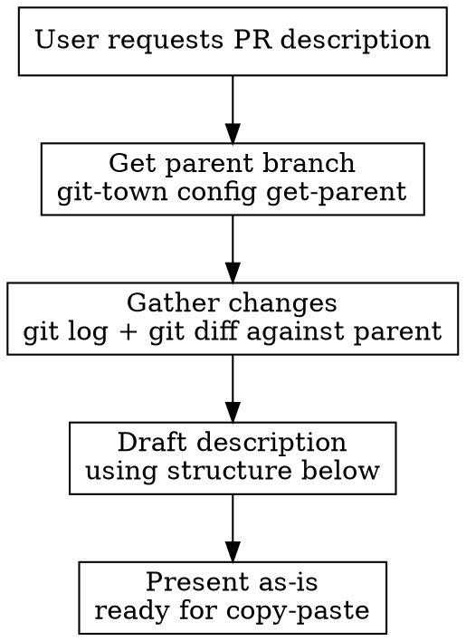

# Generate PR Description

Draft a pull request description in the user's voice, following a consistent structure and tone.

## Workflow

1. **Find parent branch**: Run `git-town config get-parent` to determine the base branch. Never assume `main`.
2. **Gather context**: Run `git log <parent>..HEAD` and `git diff <parent>...HEAD` (three dots for the merge-base diff) to understand what changed.
3. **Verify the "why"**: For each change, confirm you understand the motivation. If the commit messages and diff don't make it clear why something was changed, ask the user before drafting.
4. **Draft** using the structure and tone rules below.
5. **Present** the description as-is so the user can copy-paste it directly.

## Structure

Every PR description uses these sections. Omit a section only if it genuinely has nothing to say.

### `## Scope`

- Bullet points. Tight and to the point.
- Every bullet must pair **what** changed with **why** it changed. The "why" is the most important part. If the motivation behind a change isn't clear from the gathered context, stop and ask the user before drafting.
- Assume the reader is technical. Don't explain how the code works.
- Call out renames, removals, and structural changes explicitly.
- Mention related context when useful ("This is part of...", "Follows up on #1234").

### `## Potential Risks / Drawbacks`

- Be candid. "There's a small risk where...", "This doesn't change any business logic", "..but nobody is using it yet so 🤷"
- If there are genuinely no risks, say so briefly: "None significant. This follows the same patterns as the existing X."
- Don't fabricate risks for the sake of filling the section.

### `## Tested Scenarios`

- List specific test cases or scenarios covered.
- Be honest about coverage: "None yet. This is a brand new experiment. Let's see how it goes!" is fine.
- Reference actual test names when they exist.

### `## Review Notes`

- Optional for general notes, but **always include a review time estimate** as the last line.
- Good for: explaining non-obvious decisions, calling out related follow-up work, thinking aloud about trade-offs.
- Casual tone. This is where "I'd like to...", "Happy to adjust if you think otherwise", and footnotes fit.
- **Review time estimate**: End this section with `Estimated review time: ~Xm` (or `~Xh` for large PRs). Base it on:
  - Number of files and lines changed (from `git diff --stat`)
  - Complexity: new feature > refactor > bugfix > config change
  - Whether the reviewer needs domain context or it's self-explanatory
  - Rough guide: <50 lines across 1-2 files = ~5m, 50-200 lines = ~10-15m, 200-500 lines = ~20-30m, 500+ lines = ~45m+
  - Adjust up for unfamiliar patterns, new abstractions, or security-sensitive changes
  - Adjust down for test-only changes, snapshot updates, or mechanical refactors

## Tone

Follow the Tone of Voice rules from `~/.claude/CLAUDE.md`. Key reminders:

- **Concise and direct.** No filler paragraphs. Bullet points over prose.
- **Technically precise** when describing code changes, **casual** everywhere else.
- **Think aloud** naturally: "I'd like to...", "I think. Happy to adjust if...", "Might want to tighten that up in a follow-up."
- **Candid about limitations**: acknowledge rough edges, known issues, follow-up work.
- **Emoji sparingly**: one max per description, and only when it adds tone (🤷, 🤦, ✨).
- **Never**: AI-isms, corporate language, walls of text, em-dashes mid-sentence.

## Output

Present the drafted description as-is with no surrounding commentary, so it can be pasted directly into the GitHub PR body. If the user asks for revisions, redraft the full description.
